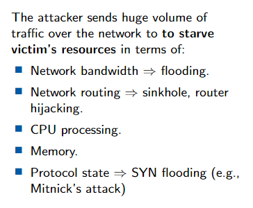

以下是关于HTTPS、TLS和SSL在网络安全中的应用及其实现细节的中文总结：

1. **网络协议栈与安全属性**：

   - 网络协议栈分为多个层次：应用层（如HTTP, SMTP, DNS等）、传输层（TCP/UDP）、网络层（IP）和链路层（如以太网802.3, WiFi 802.11等）。
   - 安全属性包括保密性（信息保持秘密）、完整性（通信不被篡改）、认证（通信发生在预期的双方之间）和可用性（通信在合理时间内完成）。
2. **网络安全威胁模型**：

   - 常见的网络攻击者可以控制网络流量，进行窃听、注入、丢弃或修改数据包。
   - 例子包括不可信的接入网络（如公共WiFi路由器、酒店网络、企业网络）、恶意ISP以及国家级别的监控（如NSA、中国的防火长城）。
3. **网络安全性协议**：

   - 应用层的安全协议包括HTTPS、PGP、Kerberos、DNSSEC等；传输层有TLS/SSL和SSH；网络层有IPSec；链路层则有WPA3、WPA2、WEP等。
4. **TLS/SSL工作原理**：

   - TLS（传输层安全）是SSL（安全套接字层）的后续版本，HTTPS是在SSL/TLS之上的HTTP。
   - TLS通过建立一个安全通道，使得客户端和服务器可以在没有事先见面的情况下进行安全对话。
   - TLS 1.3引入了快速握手（1-RTT），加密证书，并移除了许多不安全的功能，支持更少的密码套件和哈希算法。
5. **TLS记录协议**：

   - 提供认证+完整性（使用MAC）和保密性（使用加密），定义了密钥交换方法（如RSA）、块/流密码（如AES）和散列算法（如SHA-256）。
   - TLS1.2可以指定接受的hash和签名的算法
   - TLS 1.3将密钥协商和认证算法从密码套件中分离出来。
6. **前向保密**：

   - 使用临时Diffie-Hellman协议实现，确保即使服务器私钥被泄露，过去的会话密钥也不会受到影响。
7. **证书**：

   - 证书由受信任的证书颁发机构（CA）签发，用于验证公钥属于特定实体。证书包含主题、发行者、有效期、数字签名哈希、公钥信息和扩展等字段。
   - 证书链用于验证证书的有效性，无效的证书链（如自签名证书）可能允许TLS/SSL拦截。
8. **证书撤销**：

   - 撤销机制包括证书吊销列表（CRL）和在线证书状态协议（OCSP）。OCSP Stapling 是一种优化，允许在TLS握手时插入带有时间戳的OCSP响应。
   - 短期自动续期（STAR）证书是一种替代方案，通过频繁更新短期证书来减少需要撤销的情况。
9. **TLS握手协议**：

   - 握手过程分为四个阶段：确定安全能力、服务器发送证书和密钥交换、客户端验证证书并进行密钥交换、更改密码套件并完成握手。
   - TLS 1.3简化了握手流程，实现了1-RTT握手。
   - 第一阶段：建立安全能力
   - 版本、密码套件、会话 ID、随机数
   - 第二阶段：服务器
   - 发送服务器证书链， 密钥交换，
     -请求客户端证书链
   - 第三阶段：客户端
   - 验证服务器证书链
   - （可选）发送客户端证书链， 密钥交换
   - 第 4 阶段：更改套件并完成
   - （可选）验证客户端证书链
   - 更改密码套件并完成握手
   - 某些情况下存在阴影传输，仅密码套件
10. **HTTPS证书**：

    - 证书的主体常用名称（CN）或主题备用名称（SAN）应匹配URL中的域名/IP地址。
    - 浏览器检查证书的CN或SAN是否与访问的域名/IP相匹配。
11. **HTTPS锁图标**：

    - 锁图标表示页面内容对网络攻击者是安全的，并提供了页面来源的身份验证。
    - 如果所有页面元素都是通过HTTPS获取且证书链有效，则浏览器会显示锁图标。
12. **HTTPS使用情况**：

    - 截至2021年12月，约98%的Chrome页面加载使用HTTPS，77%的网站默认使用HTTPS。
    - HTTPS的广泛采用受到多种因素的影响，如性能、成本、广告网络的支持、旧版浏览器的兼容性等。
13. **HTTPS问题**：

    - 包括HTTP和HTTPS内容的混合使用、SSL剥离攻击、跨站脚本攻击（XSS）等。
    - 解决方案包括严格传输安全（HSTS）、公共密钥固定（HPKP，已废弃）、证书透明度（CT）等。

介绍了HTTPS、TLS和SSL的工作原理，强调了它们在网络通信安全中的重要性，并讨论了相关技术和挑战。

---

以下是关于网络安全课程第一部分的中文总结：

### 网络安全概览

- **背景**：网络安全涉及多个网络层的安全问题，包括数据链路层、网络层和传输层。课程探讨了端口扫描、操作系统指纹识别、拒绝服务攻击（DoS）、欺骗和数据包洪泛等技术。
- **网络通信示例**：展示了通过公共网络进行双向通信的例子，强调了通信的参与者、请求-响应机制以及保密性、完整性和认证的重要性。

### 互联网通信

- **互联网特性**：互联网包含数千种协议和服务，连接数十亿设备。
- **历史发展**：从1969年的ARPANET开始，到1974年引入TCP/IP，再到20世纪80年代的DNS，互联网经历了快速发展。
- **ISO/OSI模型**：该模型分为七层，每一层都有独立的国际标准，旨在允许开放系统的互连。各层分别为应用层、表示层、会话层、传输层、网络层、数据链路层和物理层。

### 数据链路层

- **本地网络交付**：为了在同一个网络中的机器之间传输数据包（如IP数据报），这些数据包被封装在数据链路帧中。数据链路层实现基本功能，如避免碰撞和错误处理（CRC、校验和）。最常见的是以太网帧，其中包含目标MAC地址，确保数据帧只传递给特定主机。

### 网络层

- **IPv4数据报**：封装来自更高层的数据，提供尽力而为的服务，不保证可靠性。每个数据报包含源地址和目标地址，但没有提供身份验证。还包括生存时间（TTL）字段，确保数据报不会无限期地在网络中游荡。
- **ICMP和Traceroute**：ICMP用于测试连通性，定义了多种消息类型，每种消息都封装在IP数据包中。路由器每次路由数据报时都会将TTL减1，当TTL为0时，路由器会丢弃数据报并向发送方发送“ICMP超时”消息。Traceroute通过发送具有递增TTL的数据报来枚举路径上的路由器。

### 传输层

- **UDP数据报**：提供简单的传输协议，不保证消息的确认接收或传输成功。依赖于端口抽象，支持如DNS、DHCP和NFS等协议。
- **TCP段**：提供面向连接且可靠的流传输服务，利用虚拟电路，由两个流和全双工连接组成。TCP段包括源端口、目的端口、序列号、确认号、TCP标志（如SYN、ACK、FIN、RST、PSH、URG）、窗口大小、校验和及选项字段。

### 安全威胁与攻击

- **IP欺骗**：攻击者发送来自不同IP地址的消息，使接收方回复到伪造的IP地址。在局域网中，IP欺骗等同于ARP欺骗，常用于DoS攻击。
- **TCP会话劫持**：攻击者通过猜测TCP序列号来劫持会话。例如，米特尼克攻击（Mitnick's attack）通过确定信任关系和TCP ISN，发起SYN洪水攻击，并最终完成三次握手，创建后门并清理痕迹。
- **SYN洪泛攻击**：攻击者发送大量SYN请求，填满受害者的SYN队列，使其无法接受其他连接。这种攻击针对TCP状态控制机制，速率低，不需要洪泛网络，且可以伪造源地址。

### 端口扫描

- **UDP端口扫描**：发送空的UDP数据报，根据响应判断端口状态：
  - 任何响应：端口开放
  - 无响应：端口开放或被过滤（如防火墙）
  - ICMP端口不可达错误：端口关闭
- **TCP SYN扫描**：发送带有SYN标志的段，根据响应判断端口状态：
  - SYN+ACK：端口开放
  - RST：端口关闭
  - 无响应：端口被过滤

### 入侵检测与防御

- **入口过滤**：ISP通过过滤进入网络的带有伪造IP地址的数据包来防止IP欺骗，遵循RFC 2827和3704。然而，部署挑战包括需要大多数ISP参与以及对其他网络的好处有限，导致部署激励不足。
- **Spoofer项目**：基于众包的方式，志愿者在其网络上运行测试，测量入口和出口过滤的部署情况。结果显示，约18.5%的自治系统可被伪造，17.3%的IPv4块可被伪造，而在IPv6中这一比例更高。

### 暗网与背散射

- **暗网（Darknet）**：监控未使用的地址空间，接收扫描和DoS背散射流量。如果源地址（用于伪造）或目的地址（用于扫描）随机选择，暗网将按其大小比例接收流量。CAIDA望远镜监测到每周约有2,000-3,000次攻击。

介绍了网络安全的基本概念、网络协议栈、各层的功能、常见的攻击手段及其防御措施，特别关注了端口扫描、IP欺骗、TCP会话劫持和SYN洪泛攻击等内容。

---

以下是关于网络安全课程第二部分的中文总结：

### SYN 洪泛攻击回顾

- **SYN 洪泛的工作原理**：
  - 协议：TCP（而非UDP）
  - 目标1：协议本身（而非网络带宽）
  - 目标2：单个应用程序（而非整个主机）
  - 源地址伪造：可选，但通常使用不可达的主机
  - 攻击方式：通过发送大量SYN请求，填满受害者的SYN队列，使其无法接受其他连接。
  - Bandwidth Amplification Factor	BAF = size(payloadtovictim) / size(payloadtoreflector)
  - Packet Amplification Factor		PAF = packetstovictim / packetstoreflector

■Bot:compromised machine controlled by a third-party entity.

■Botnet:network of (thousands) of compromised machines underthe control of a single third-party entity.

■Botmaster:The entity/group that controls the compromisedmachines that are part of the botnet.

### 防御措施

- **SYN Cookies**：
  - 思想：在建立连接后存储状态信息。
  - 实现方法：使用智能选择的服务器初始序列号（ISN），将状态信息编码到ISN中。具体来说，ISN由时间戳、最大段大小（MSS）、随机密钥K和哈希函数生成的部分组成。
- **入口过滤**：
  - ISP通过过滤进入网络的带有伪造IP地址的数据包来防止IP欺骗，遵循RFC 2827和3704。
- **客户端谜题**：
  - 要求客户端执行一些计算工作以减慢攻击者的速度。例如，给定挑战C，找到X使得 `LSBn(SHA1(C || X)) = 0n`，这需要2^n次尝试，对于n=16，在1GHz机器上大约需要0.3秒。
- **Web应用防火墙 (WAF)**：
  - 作为反向代理拦截HTTP流量，过滤恶意流量并转发有效请求到网站。
- **专用DoS防护服务**：
  - 通常与内容分发网络（CDN）服务结合提供，路由用户到最近的WAF/CDN服务器，过滤恶意流量并缓存静态内容。
- **CAPTCHA**：
  - 用于验证连接来自人类，区分人类和机器人。当负载增加时，会要求用户完成CAPTCHA才能继续连接。然而，CAPTCHA仅适用于应用层攻击，不能防御洪泛攻击，并且可能会误判使用VPN或NAT的合法用户。

### 分布式拒绝服务 (DDoS) 攻击

- **Lizard Stresser**：
  - 由Lizard Squad组织编写，利用Telnet暴力破解登录凭据，感染家庭、大学和公司路由器（2015年前的恶意软件），后来泄露源代码后转向感染网络摄像头和数字视频录制系统（2016年后的恶意软件）。支持多种DDoS攻击类型，如保持TCP连接、发送随机字符串到TCP端口、发送UDP数据包等。2014年12月25日，该僵尸网络使索尼PlayStation和微软Xbox网络下线，以此推广其新服务。
- **DDoS即服务**：
  - 在防弹托管提供商上托管市场，支持多种支付方式（如PayPal、信用卡、比特币），价格根据DDoS攻击的持续时间而定。

### 最大的DDoS攻击

- **GitHub (2018, 1.3 Tbps)**、**Amazon AWS (2020, 2.3 Tbps)** 和 **Microsoft (2021, 3.25 Tbps)** 都曾遭受过大规模DDoS攻击。

DNS DDos，JavaScript DDos Attack

Dos Defenses：Ingress Filtering，SYN Cookies

WAF: web application firewall，a reverse proxy that intercepts HTTP traffic

### 追溯攻击源

- **追查回溯**：
  - 目标是确定数据包来源，即使存在IP欺骗。通过配置路由器在每个数据包中包含路径信息，简单的方法是每个路由器将自己的IP地址附加到数据包中，目标（受害者）可以重建到源（攻击者）的路径。提出了几种解决方案，如“实用网络支持IP追溯”、“基于哈希的IP追溯”和“代数方法的IP追溯”。

### 动态流量过滤

- **推回过滤 (Pushback Filtering)**：
  - 思想是在骨干网上进行动态流量过滤，通过检测和控制高带宽流量子集，将过滤推向攻击源。路由器实现以下过程：
    1. 是否严重拥塞？检查丢包率是否超过阈值。
    2. 如果是，能否识别出对拥塞有显著贡献的流量子集？聚类高容量流量样本。
    3. 如果可以，限制流量子集的程度是多少？是否也要求上游路由器限制？

### 容量机制

- **能力 (Capabilities)**：
  - 思想是发送数据包之前，节点必须先从目的地获得“发送许可”。接收方为那些同意接受其流量的发送方提供令牌或能力。过程包括：
    1. 发送方请求能力，使用路径标识符限制来自单一来源的请求数量。
    2. 如果需要，接收方响应一个能力。
    3. 发送方在所有未来的数据包中包含该能力。
  - 路由器只转发两种类型的包：请求包和带有有效能力的包。能力需要定期更新，接收方通知发送方。

介绍了SYN洪泛攻击及其防御措施，包括SYN Cookies、入口过滤、客户端谜题、WAF、专用DoS防护服务和CAPTCHA。还探讨了DDoS攻击的演变，特别是Lizard Stresser僵尸网络，以及最大的DDoS攻击案例。最后，讨论了追查攻击源的技术和动态流量过滤及容量机制等高级防御策略。
