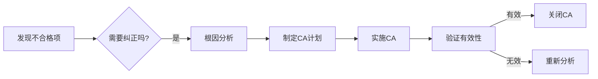
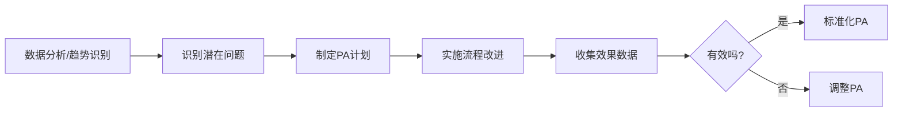

# 软件质量管理

安杰莉卡·德·安东尼奥

## 课程大纲

- 第1部分：软件质量导论
- 第2部分：软件质量控制活动
- 第3部分：质量度量
- 第4部分：质量管理与质量体系
- 第5部分：软件质量保证活动
- 第6部分：软件配置管理

### 质量保证（ASQ定义）

- 在质量体系中实施的有计划、有系统的活动，以确保产品或服务满足质量要求。
- **核心特点**：预防性、面向流程的主动管理方法。

### 质量保证 vs. 质量控制

| **质量保证（QA）**         | **质量控制（QC）**               |
| -------------------------------- | -------------------------------------- |
| 预防性活动，聚焦流程优化。       | 检测性活动，聚焦产品缺陷发现。         |
| 定义质量控制活动的执行框架。     | 基于测试和检查生成报告，为QA提供输入。 |
| 目标：确保流程合规性，预防缺陷。 | 目标：识别产品缺陷，反馈质量问题。     |

**协作关系**：

- QA定义QC活动，QC向QA反馈结果，QA根据结果制定纠正和预防措施。

### 质量保证的职能

#### 人员配置

- 每15-40名开发人员配置1名QA人员。

#### 核心职责

1. **确保目标达成**：
   - 满足组织和客户目标，解决两者间的冲突。
2. **过程合规性检查**：
   - 开发活动是否遵循既定流程、标准、政策及工作指南。
3. **优化目标**：
   - 优化成本、性能和有效性。

### 项目中的质量保证任务

#### 1. 质量规划（Quality Planning）

- 定义质量要求（如功能、性能、合规性）。
- 选择合适的质量控制活动（如代码审查、测试类型）。

#### 2. 质量监督（Quality Supervision）

- 监控质量控制结果（如测试通过率、缺陷率）。
- 识别不合格项，决定是否启动纠正措施（Corrective Action, CA）。
  - **纠正措施流程**：
    1. 发现不合格项 → 2. 分析根本原因 → 3. 制定并实施措施 → 4. 验证有效性 → 5. 关闭或重新处理。

#### 3. 质量构建（Quality Construction）

- 建立预防性活动以避免缺陷注入（如流程改进、培训）。
- **预防措施流程（Preventive Action, PA）**：
  1. 通过数据分析识别潜在问题 → 2. 修改流程以预防不合格项 → 3. 验证措施有效性 → 4. 标准化改进。

### 质量保证计划（SQA Plan）大纲

1. **目的和范围**：明确QA活动的目标和覆盖范围。
2. **定义和缩写**：术语解释（如SQA、RCA）。
3. **参考文档**：引用的标准、流程文件等。
4. **计划概述**：
   - 组织架构与独立性
   - 软件产品风险
   - 工具与技术
   - 标准、实践与规范
   - 资源与进度安排
5. **活动与任务**：
   - **产品保证**：评估计划、产品合规性、生命周期支持等。
   - **过程保证**：评估流程、环境、分包商过程等。
6. **其他考虑**：
   - 合同评审、质量度量、偏差管理、风险评估等。

### 质量构建的干预领域

1. **技术层面**：
   - 软件工程实践（如设计模式、代码规范）。
2. **管理层面**：
   - 项目管理（如进度跟踪、资源分配）。
3. **人员层面**：
   - 技能培训、团队协作、标准化流程执行。

### 质量构建工具

1. **开发与测试工具**：
   - 测试用例生成器、自动化测试执行工具、结果监控与报告工具。
2. **流程管理工具**：
   - 估算与规划工具（如PERT图、甘特图）、配置管理工具（如Git、SVN）。
3. **文档与变更控制**：
   - 需求管理工具（如Jira）、变更跟踪系统。

### 关键流程图示

#### 纠正措施（CA）流程

#### 预防措施（PA）流程

### 总结

软件质量保证（SQA）通过**预防为主、流程驱动**的方法，确保开发过程合规性和产品质量，结合质量控制的反馈形成闭环管理。其核心在于通过规划、监督和构建预防性措施，降低缺陷率，提升组织整体效率和客户满意度。
